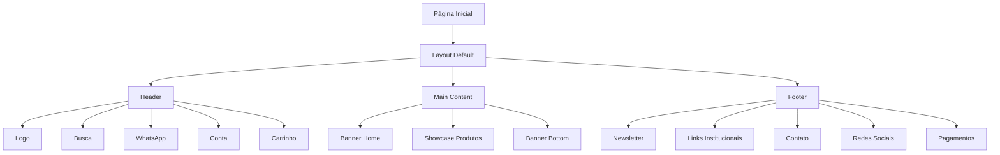
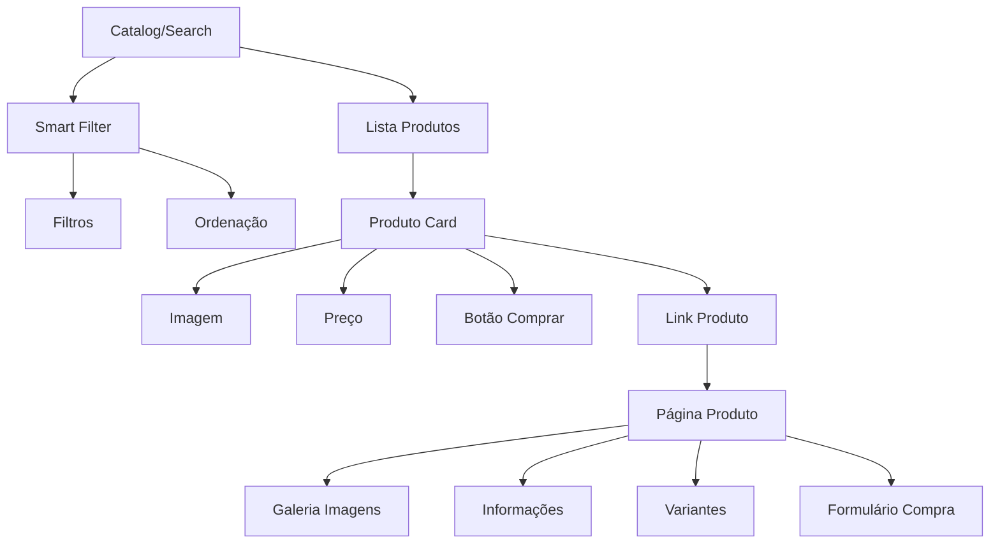
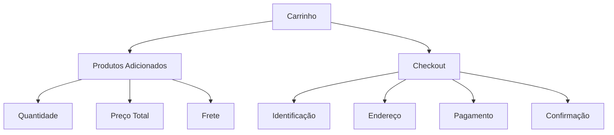
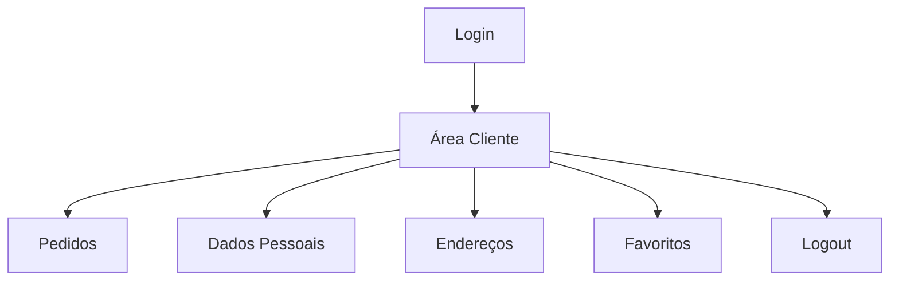

# Documentação Técnica da Arquitetura Atual

## Índice
1. [Fluxo de Dados](#fluxo-de-dados)
2. [Arquitetura de Templates](#arquitetura-de-templates)
3. [Sistema de Configurações](#sistema-de-configurações)
4. [Componentes Críticos](#componentes-críticos)
5. [Fluxos de Integração](#fluxos-de-integração)
6. [Padrões de Código Atuais](#padrões-de-código-atuais)
7. [Recomendações de Melhoria](#recomendações-de-melhoria)

---

## 1. Fluxo de Dados

### 1.1 Página Inicial → Componentes



### 1.2 Listagem → Produto Individual



### 1.3 Carrinho → Checkout



### 1.4 Área do Cliente



---

## 2. Arquitetura de Templates

### 2.1 Hierarquia de Templates

```
layouts/default.html
├── elements/header.html
│   ├── snippets/menu.html
│   ├── snippets/search.html
│   └── snippets/cart.html
├── [CONTEÚDO DINÂMICO]
│   ├── pages/home.html
│   ├── pages/catalog.html
│   ├── pages/product.html
│   └── pages/search.html
├── elements/sidebar-left.html
├── elements/sidebar-central.html
└── elements/footer.html
    ├── snippets/newsletter.html
    └── snippets/social-list.html
```

### 2.2 Estrutura de Páginas

| Página | Template | Componentes Principais |
|--------|----------|----------------------|
| Home | `pages/home.html` | Banner, Showcase, Produtos em Destaque |
| Catalog | `pages/catalog.html` | Filtros, Lista Produtos, Paginação |
| Product | `pages/product.html` | Galeria, Informações, Formulário Compra |
| Search | `pages/search.html` | Resultados Busca, Filtros |

### 2.3 Layout Responsivo

- **Desktop**: Sidebar + Conteúdo Principal (9 colunas)
- **Mobile**: Menu Mobile + Conteúdo Full Width
- **Breakpoints**: Bootstrap padrão (xs, sm, md, lg)

---

## 3. Sistema de Configurações

### 3.1 Estrutura do settings.json

```json
{
  "current": {
    "theme_id": "33",
    "social_facebook": "https://www.facebook.com/traytecnologia/",
    "social_twitter": "https://x.com/tray",
    "social_instagram": "https://www.instagram.com/tray",
    "social_youtube": "https://www.youtube.com/user/TraySistemas",
    "social_pinterest": "https://www.pinterest.com/tray",
    "whatsapp": "(00) 00000-0000",
    "structure": "1",
    "background_image": "",
    "color_background": "#f1f1f1",
    "color_primary": "#000000",
    "color_buybutton": "#28a527",
    "color_icons": "#ffffff",
    "showcase": "featured",
    "banner_interval": "4000",
    "banner_arrows": true,
    "banner_dots": true,
    "banner_autoplay": true,
    "custom_css": "..."
  }
}
```

### 3.2 Configurações Principais

| Categoria | Configurações | Impacto |
|-----------|---------------|---------|
| **Cores** | color_primary, color_buybutton, color_icons | Aparência visual |
| **Redes Sociais** | social_facebook, social_twitter, etc. | Links no footer |
| **WhatsApp** | whatsapp | Contato e integração |
| **Banner** | banner_interval, banner_arrows, etc. | Comportamento slider |
| **Produtos** | showcase, show_available_products | Exibição produtos |
| **Layout** | structure, background_image | Estrutura visual |

### 3.3 Interface Admin (settings.html)

- **Localização**: `configs/settings.html`
- **Tamanho**: 120KB, 2074 linhas
- **Funcionalidades**: 
  - Configuração de cores
  - Links redes sociais
  - Configurações de banner
  - CSS customizado
  - Configurações de produtos

---

## 4. Componentes Críticos

### 4.1 Header

**Localização**: `elements/header.html`

**Dependências**:
- CSS: `css/theme.min.css`
- JS: `js/theme.min.js`
- Imagens: `img/menu.svg`

**Variáveis Tray Utilizadas**:
- `{{ store.name }}` - Nome da loja
- `{{ links.home }}` - Link home
- `{{ links.search }}` - Link busca
- `{{ links.cart }}` - Link carrinho
- `{{ links.login }}` - Link login
- `{{ cart.amount }}` - Quantidade carrinho
- `{{ cart.price }}` - Valor carrinho
- `{{ settings.color_icons }}` - Cor ícones

**Estados Possíveis**:
- Logado/Deslogado
- Carrinho vazio/com itens
- Mobile/Desktop

**Problemas Conhecidos**:
- WhatsApp hardcoded no header
- Responsividade limitada

### 4.2 Footer

**Localização**: `elements/footer.html`

**Dependências**:
- `snippets/newsletter.html`
- `snippets/social-list.html`
- `snippets/payment-list.html`

**Variáveis Tray Utilizadas**:
- `{{ Translation('institucional') }}`
- `{{ pages.custom }}` - Páginas customizadas
- `{{ Translation('ag_atendimento') }}`
- `{{ Translation('ag_telefone_1') }}`
- `{{ Translation('ag_email_1') }}`

**Estados Possíveis**:
- Com/sem redes sociais
- Com/sem informações de contato
- Com/sem selos de segurança

### 4.3 Showcase (Produtos)

**Localização**: `elements/showcase.html`

**Dependências**:
- `snippets/product.html`
- CSS: Classes `.product`, `.product-price`

**Variáveis Tray Utilizadas**:
- `{{ products }}` - Lista de produtos
- `{{ settings.showcase }}` - Tipo de exibição
- `{{ settings.limitProducts }}` - Limite de produtos

**Estados Possíveis**:
- Produtos em destaque
- Produtos novos
- Produtos mais vendidos
- Produtos com frete grátis

### 4.4 Smart Filter

**Localização**: `elements/smartfilter.html`

**Dependências**:
- `elements/new-smart-filter.html`
- CSS: Classes `.filter`, `.filter-item`

**Variáveis Tray Utilizadas**:
- `{{ category.brands }}` - Marcas da categoria
- `{{ settings.enable_filter }}` - Habilitar filtros

**Estados Possíveis**:
- Filtros ativos/inativos
- Múltiplos filtros selecionados
- Ordenação aplicada

### 4.5 Carrinho

**Localização**: `snippets/cart.html`

**Dependências**:
- CSS: Classes `.cart`, `.cart-icon`
- JS: Função `addCart()`

**Variáveis Tray Utilizadas**:
- `{{ cart.amount }}` - Quantidade
- `{{ cart.price }}` - Valor total
- `{{ links.cart }}` - Link carrinho

**Estados Possíveis**:
- Vazio
- Com itens
- Atualizando

---

## 5. Fluxos de Integração

### 5.1 Google Tag Manager

**Implementação**:
```html
<!-- Header -->
{{ googleTagManager.header(pages.current, tagManagerData) }}

<!-- Body Top -->
{{ googleTagManager.top(pages.current, tagManagerData) }}

<!-- Body Bottom -->
{{ googleTagManager.bottom(pages.current, tagManagerData) }}
```

**Eventos Trackeados**:
- Pageview (todas as páginas)
- Produto visualizado
- Adição ao carrinho
- Início checkout

### 5.2 Analytics

**Eventos Implementados**:
- Visualização de produto
- Adição ao carrinho
- Busca realizada
- Navegação por categoria

### 5.3 WhatsApp

**Integração Atual**:
```html
<!-- Header -->
<span class="contact-number">(11) 99999-9999</span>

<!-- Footer -->
<a href="https://api.whatsapp.com/send?phone=55{{ settings.whatsapp|replace({'(': '', ')': '', '-': '', ' ': ''}) }}" target="_blank">
```

**Configuração**:
- Campo: `settings.whatsapp`
- Formato: "(00) 00000-0000"
- Limpeza automática de caracteres especiais

### 5.4 APIs Tray Utilizadas

| API | Uso | Localização |
|-----|-----|-------------|
| **Products** | Listagem produtos | `pages/home.html`, `pages/catalog.html` |
| **Cart** | Adição ao carrinho | `js/theme.js` |
| **Search** | Busca produtos | `pages/search.html` |
| **Customer** | Dados cliente | `snippets/customer.html` |

---

## 6. Padrões de Código Atuais

### 6.1 Convenções de Nomenclatura

**CSS**:
- Classes: `.kebab-case`
- IDs: `#camelCase`
- Prefixos: `.product-`, `.cart-`, `.header-`

**JavaScript**:
- Funções: `camelCase`
- Variáveis: `camelCase`
- Constantes: `UPPER_CASE`

**Templates**:
- Arquivos: `snake_case.html`
- Variáveis: `{{ variable_name }}`
- Elementos: ``

### 6.2 Estrutura de Classes CSS

```css
/* Componente Principal */
.component-name {
    /* Estilos base */
}

/* Estados */
.component-name--state {
    /* Estilos de estado */
}

/* Elementos filhos */
.component-name__child {
    /* Estilos do filho */
}

/* Responsivo */
@media (max-width: 768px) {
    .component-name {
        /* Estilos mobile */
    }
}
```

### 6.3 Padrões JavaScript

**jQuery**:
```javascript
$(document).ready(function() {
    // Inicialização
});

// Eventos
$('.element').on('click', function() {
    // Handler
});

// AJAX
$.ajax({
    method: "POST",
    url: "/api/endpoint",
    data: data
}).done(function(response) {
    // Success
});
```

**Vanilla JS**:
```javascript
// Event Listeners
element.addEventListener('click', function() {
    // Handler
});

// DOM Manipulation
document.querySelector('.class');
```

### 6.4 Organização de Arquivos

```
/
├── layouts/          # Layouts principais
├── elements/         # Componentes estruturais
│   └── snippets/     # Componentes menores
├── pages/           # Páginas específicas
├── configs/         # Configurações
├── css/             # Estilos
├── js/              # JavaScript
│   └── modules/     # Módulos JS
├── img/             # Imagens
└── config.yml       # Configuração tema
```

---

## 7. Recomendações de Melhoria

### 7.1 Por Componente

| Componente | Problema | Recomendação |
|------------|----------|--------------|
| **Header** | WhatsApp hardcoded | Usar `settings.whatsapp` |
| **Header** | Responsividade limitada | Implementar menu mobile melhorado |
| **Cart** | Sem atualização AJAX | Implementar atualização em tempo real |
| **Search** | Sem autocomplete | Adicionar sugestões de busca |
| **Filter** | Performance limitada | Implementar filtros AJAX |
| **Product** | Galeria básica | Melhorar zoom e navegação |

### 7.2 Arquitetura Geral

**Problemas Identificados**:
1. **Acoplamento alto** entre componentes
2. **CSS não modularizado**
3. **JavaScript não organizado em módulos**
4. **Falta de padronização** em alguns componentes
5. **Performance** de carregamento

**Recomendações**:
1. **Modularizar CSS** usando metodologia BEM
2. **Organizar JavaScript** em módulos ES6
3. **Implementar lazy loading** para imagens
4. **Otimizar carregamento** de recursos
5. **Padronizar** nomenclatura de classes
6. **Implementar** sistema de cache
7. **Melhorar** acessibilidade (ARIA labels)
8. **Adicionar** testes automatizados

### 7.3 Performance

**Otimizações Sugeridas**:
- Minificar CSS e JS
- Comprimir imagens
- Implementar CDN
- Usar lazy loading
- Otimizar fontes web
- Implementar service worker

### 7.4 Segurança

**Melhorias Necessárias**:
- Validar inputs do usuário
- Sanitizar dados de saída
- Implementar CSP (Content Security Policy)
- Usar HTTPS em todas as requisições
- Validar tokens CSRF

---

## Conclusão

Esta documentação fornece uma visão completa da arquitetura atual do tema, servindo como base para:

1. **Decisões arquiteturais** durante a refatoração
2. **Referência técnica** para a equipe de desenvolvimento
3. **Identificação de pontos de melhoria**
4. **Planejamento da migração**

A arquitetura atual, embora funcional, apresenta oportunidades significativas de melhoria em termos de modularidade, performance e manutenibilidade. 